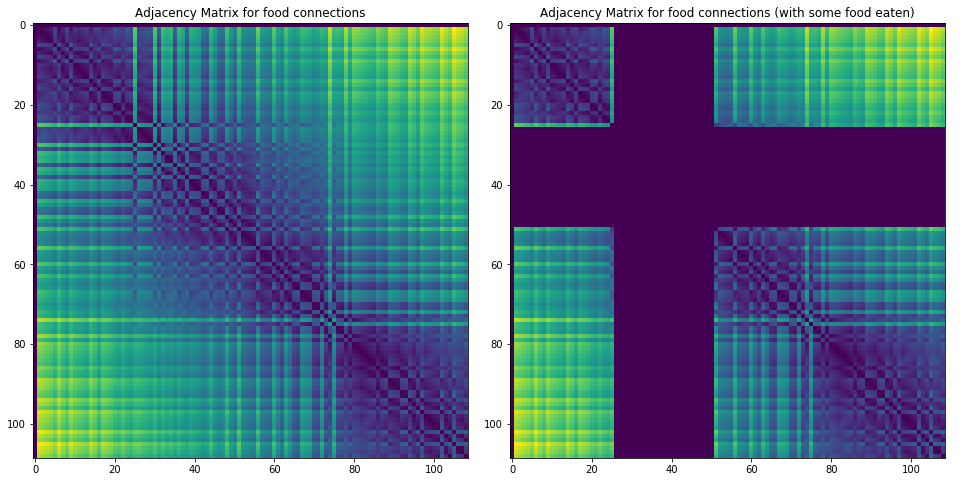

# Project 1: Search
Version 1.002. Last Updated: 08/27/2018.

**Disclaimer:**
This is my attempt at the CS188 coursework 1 from the University of California, Berkeley. I am not a student at U.C. Berkeley, however, I've been following the online resources available at https://inst.eecs.berkeley.edu/~cs188/fa18/.

This README is a modified version of the project page on the website. Many details have been removed and there are sections detailing my answers to each question. The following answers achieve full marks (plus extra credit).

## Table of Contents
* Introduction
* Q1: Depth First Search
* Q2: Breadth First Search
* Q3: Uniform Cost Search
* Q4: A* Search
* Q5: Corners Problem: Representation
* Q6: Corners Problem: Heuristic
* Q7: Eating All The Dots: Heuristic
* Q8: Suboptimal Search
* Autograder Report


All those coloured walls,
Mazes give Pacman the blues,
So teach him to search.

## Introduction
In this project, your Pacman agent will find paths through his maze world, both to reach a particular location and to collect food efficiently. You will build general search algorithms and apply them to Pacman scenarios.

This project includes an autograder for you to grade your answers on your machine. This can be run with the command:

python autograder.py
See the autograder tutorial in Project 0 for more information about using the autograder.

The code for this project consists of several Python files, some of which you will need to read and understand in order to complete the assignment, and some of which you can ignore. You can download all the code and supporting files as a zip archive.

| Files you'll edit: | |
| ------------------ |  -------------- |
| `search.py` |	Where all of your search algorithms will reside. |
| `searchAgents.py` |	Where all of your search-based agents will reside. |

| Files you might want to look at: | |
| ------------------ |  -------------- |
| `pacman.py` |	The main file that runs Pacman games. This file describes a  Pacman GameState type, which you use in this project. |
| `game.py` |	The logic behind how the Pacman world works. This file describes  several supporting types like AgentState, Agent, Direction, and Grid. |
| `util.py` |	Useful data structures for implementing search algorithms. |

| Supporting files you can ignore: | |
| -------------------------------- | ----------- |
| `graphicsDisplay.py`  |	Graphics for Pacman |
| `graphicsUtils.py` |	Support for Pacman graphics |
| `textDisplay.py` |	ASCII graphics for Pacman |
| `ghostAgents.py` |	Agents to control ghosts |
| `keyboardAgents.py` |	Keyboard interfaces to control Pacman |
| `layout.py` |	Code for reading layout files and storing their contents |
| `autograder.py` |	Project autograder |
| `testParser.py` |	Parses autograder test and solution files |
| `testClasses.py` |	General autograding test classes |
| `test_cases/`	| Directory containing the test cases for each question |
| `searchTestClasses.py` |	Project 1 specific autograding test classes |


## Welcome to Pacman
After downloading the code (search.zip), unzipping it, and changing to the directory, you should be able to play a game of Pacman by typing the following at the command line:

`python pacman.py`

Pacman lives in a shiny blue world of twisting corridors and tasty round treats. Navigating this world efficiently will be Pacman's first step in mastering his domain.

The simplest agent in `searchAgents.py` is called the `GoWestAgent`, which always goes West (a trivial reflex agent). This agent can occasionally win:

`python pacman.py --layout testMaze --pacman GoWestAgent`

But, things get ugly for this agent when turning is required:

`python pacman.py --layout tinyMaze --pacman GoWestAgent`

If Pacman gets stuck, you can exit the game by typing CTRL-c into your terminal.

Soon, your agent will solve not only `tinyMaze`, but any maze you want.

Note that pacman.py supports a number of options that can each be expressed in a long way (e.g., `--layout`) or a short way (e.g., `-l`). You can see the list of all options and their default values via:

`python pacman.py -h`

Also, all of the commands that appear in this project also appear in commands.txt, for easy copying and pasting. In UNIX/Mac OS X, you can even run all these commands in order with bash `commands.txt`.

---

## Question 1 (3 points): Finding a Fixed Food Dot using Depth First Search

In `searchAgents.py`, you'll find a fully implemented `SearchAgent`, which plans out a path through Pacman's world and then executes that path step-by-step. The search algorithms for formulating a plan are not implemented -- that's your job. As you work through the following questions, you might find it useful to refer to the object glossary (the second to last tab in the navigation bar above).

First, test that the `SearchAgent` is working correctly by running:

`python pacman.py -l tinyMaze -p SearchAgent -a fn=tinyMazeSearch`

The command above tells the `SearchAgent` to use `tinyMazeSearch` as its search algorithm, which is implemented in search.py. Pacman should navigate the maze successfully.

Now it's time to write full-fledged generic search functions to help Pacman plan routes! Pseudocode for the search algorithms you'll write can be found in the lecture slides. Remember that a search node must contain not only a state but also the information necessary to reconstruct the path (plan) which gets to that state.

**Important note:** All of your search functions need to return a list of actions that will lead the agent from the start to the goal. These actions all have to be legal moves (valid directions, no moving through walls).

**Important note:** Make sure to use the `Stack`, `Queue` and `PriorityQueue` data structures provided to you in util.py! These data structure implementations have particular properties which are required for compatibility with the autograder.

**Hint:** Each algorithm is very similar. Algorithms for DFS, BFS, UCS, and A* differ only in the details of how the fringe is managed. So, concentrate on getting DFS right and the rest should be relatively straightforward. Indeed, one possible implementation requires only a single generic search method which is configured with an algorithm-specific queuing strategy. (Your implementation need not be of this form to receive full credit).

Implement the depth-first search (DFS) algorithm in the `depthFirstSearch` function in `search.py`. To make your algorithm complete, write the graph search version of DFS, which avoids expanding any already visited states.

Your code should quickly find a solution for:

`python pacman.py -l tinyMaze -p SearchAgent`

`python pacman.py -l mediumMaze -p SearchAgent`

`python pacman.py -l bigMaze -z .5 -p SearchAgent`

The Pacman board will show an overlay of the states explored, and the order in which they were explored (brighter red means earlier exploration). Is the exploration order what you would have expected? Does Pacman actually go to all the explored squares on his way to the goal?

**Hint:** If you use a Stack as your data structure, the solution found by your DFS algorithm for `mediumMaze` should have a length of 130 (provided you push successors onto the fringe in the order provided by `getSuccessors`; you might get 246 if you push them in the reverse order). Is this a least cost solution? If not, think about what depth-first search is doing wrong.

## Answer

The following is the code implementing a general search process where the DFS is a specific version with a stack as the fringe. This means that things put onto the fringe first are dealt with last, therefore, when a node `n` is dequeued it will put all of it's successors on the fringe to be dealt with before the nodes alongside `n` depth-wise.

```py
def generalTreeSearch(problem, fringe):
    fringe.push((None, problem.getStartState(), None, 0))
    visited = dict()

    def addSuccesorsToFringe(start, cost):
        for next, action, added_cost in problem.getSuccessors(start):
            if hash(next) not in visited:
                fringe.push((start, next, action, cost + added_cost))

    def pathTo(end):
        state, action = visited[hash(end)]
        actions = []

        while action is not None:
            actions.append(action)
            state, action = visited[hash(state)]

        return actions[::-1]

    while not fringe.isEmpty():
        start, next, action, cost = fringe.pop()

        if hash(next) in visited:
            continue

        visited[hash(next)] = (start, action)

        if problem.isGoalState(next):
            return pathTo(next)

        addSuccesorsToFringe(next, cost)

    return []


def depthFirstSearch(problem):
    """
    Search the deepest nodes in the search tree first.

    Your search algorithm needs to return a list of actions that reaches the
    goal. Make sure to implement a graph search algorithm.
    """
    return generalTreeSearch(problem, util.Stack())
```

---

## Question 2 (3 points): Breadth First Search
Implement the breadth-first search (BFS) algorithm in the breadthFirstSearch function in search.py. Again, write a graph search algorithm that avoids expanding any already visited states. Test your code the same way you did for depth-first search.

`python pacman.py -l mediumMaze -p SearchAgent -a fn=bfs`

`python pacman.py -l bigMaze -p SearchAgent -a fn=bfs -z .5`

Does BFS find a least cost solution? If not, check your implementation.

**Hint:** If Pacman moves too slowly for you, try the option `--frameTime 0`.

**Note:** If you've written your search code generically, your code should work equally well for the eight-puzzle search problem without any changes.

`python eightpuzzle.py`

## Answer

Building upon the answer for question 1, the general search algorithm is used again except with a queue as the fringe, therefore, allowing all the nodes at a given depth to be dealt with contiguously.

```py
def breadthFirstSearch(problem):
    """Search the shallowest nodes in the search tree first."""
    return generalTreeSearch(problem, util.Queue())
```

---

## Question 3 (3 points): Varying the Cost Function
While BFS will find a fewest-actions path to the goal, we might want to find paths that are "best" in other senses. Consider `mediumDottedMaze` and `mediumScaryMaze`.

By changing the cost function, we can encourage Pacman to find different paths. For example, we can charge more for dangerous steps in ghost-ridden areas or less for steps in food-rich areas, and a rational Pacman agent should adjust its behavior in response.

Implement the uniform-cost graph search algorithm in the `uniformCostSearch` function in search.py. We encourage you to look through util.py for some data structures that may be useful in your implementation. You should now observe successful behavior in all three of the following layouts, where the agents below are all UCS agents that differ only in the cost function they use (the agents and cost functions are written for you):

`python pacman.py -l mediumMaze -p SearchAgent -a fn=ucs`

`python pacman.py -l mediumDottedMaze -p StayEastSearchAgent`

`python pacman.py -l mediumScaryMaze -p StayWestSearchAgent`

Note: You should get very low and very high path costs for the `StayEastSearchAgent` and `StayWestSearchAgent` respectively, due to their exponential cost functions (see `searchAgents.py` for details).

## Answer

The general search algorithm is used once again, however, now the fringe is PriorityQueue where the priority is derived from a fringe item `(state, next_state, action, cost)` by taking the cost.

```py
def uniformCostSearch(problem):
    """Search the node of least total cost first."""
    def fringeFn(item):
        state_s, state_e, action, cost = item
        return cost
    fringe = util.PriorityQueueWithFunction(fringeFn)
    return generalTreeSearch(problem, fringe)
```

---

## Question 4 (3 points): A* search

Implement A* graph search in the empty function `aStarSearch` in `search.py`. A* takes a heuristic function as an argument. Heuristics take two arguments: a state in the search problem (the main argument), and the problem itself (for reference information). The `nullHeuristic` heuristic function in search.py is a trivial example.

You can test your A* implementation on the original problem of finding a path through a maze to a fixed position using the Manhattan distance heuristic (implemented already as `manhattanHeuristic` in `searchAgents.py`).

`python pacman.py -l bigMaze -z .5 -p SearchAgent -a fn=astar,heuristic=manhattanHeuristic`

You should see that A* finds the optimal solution slightly faster than uniform cost search (about 549 vs. 620 search nodes expanded in our implementation, but ties in priority may make your numbers differ slightly). What happens on `openMaze` for the various search strategies?

## Answer

The answer here is similar to the UCS example, however, the priority of an item is given by it's cost plus the heuristic for the end state of the action. This is given by the definition of A*.

```py
def aStarSearch(problem, heuristic=nullHeuristic):
    """Search the node that has the lowest combined cost and heuristic first."""
    def fringeFn(item):
        state_s, state_e, action, cost = item
        return cost + heuristic(state_e, problem=problem)
    fringe = util.PriorityQueueWithFunction(fringeFn)
    return generalTreeSearch(problem, fringe)
```

---

## Question 5 (3 points): Finding All the Corners

The real power of A* will only be apparent with a more challenging search problem. Now, it's time to formulate a new problem and design a heuristic for it.

In corner mazes, there are four dots, one in each corner. Our new search problem is to find the shortest path through the maze that touches all four corners (whether the maze actually has food there or not). Note that for some mazes like `tinyCorners`, the shortest path does not always go to the closest food first! Hint: the shortest path through `tinyCorners` takes 28 steps.

**Note:** Make sure to complete Question 2 before working on Question 5, because Question 5 builds upon your answer for Question 2.

Implement the `CornersProblem` search problem in `searchAgents.py`. You will need to choose a state representation that encodes all the information necessary to detect whether all four corners have been reached. Now, your search agent should solve:

`python pacman.py -l tinyCorners -p SearchAgent -a fn=bfs,prob=CornersProblem`

`python pacman.py -l mediumCorners -p SearchAgent -a fn=bfs,prob=CornersProblem`

To receive full credit, you need to define an abstract state representation that does not encode irrelevant information (like the position of ghosts, where extra food is, etc.). In particular, do not use a Pacman `GameState` as a search state. Your code will be very, very slow if you do (and also wrong).

**Hint:** The only parts of the game state you need to reference in your implementation are the starting Pacman position and the location of the four corners.

Our implementation of `breadthFirstSearch` expands just under 2000 search nodes on `mediumCorners`. However, heuristics (used with A* search) can reduce the amount of searching required.

## Answer

The following is the relevant changes made to the `CornersProblem` class. The approach was to store the state as a tuple of Pacman's position and the remaining corners to be visited. The problem is solved when Pacman's position is equal to the only remaining unvisited corner. The successors are computed by filtering illegal locations and then constructing the next state by filtering the unvisited corners to make sure none of them are Pacman's current position.

```py
class CornersProblem(search.SearchProblem):
    """
    This search problem finds paths through all four corners of a layout.

    You must select a suitable state space and successor function
    """

    def __init__(self, startingGameState):
        """
        Stores the walls, pacman's starting position and corners.
        """
        self.walls = startingGameState.getWalls()
        self.startingPosition = startingGameState.getPacmanPosition()
        top, right = self.walls.height-2, self.walls.width-2
        self.corners = ((1, 1), (1, top), (right, 1), (right, top))
        for corner in self.corners:
            if not startingGameState.hasFood(*corner):
                print('Warning: no food in corner ' + str(corner))
        self._expanded = 0  # DO NOT CHANGE; Number of search nodes expanded
        # Please add any code here which you would like to use
        # in initializing the problem

        self.startState = (self.startingPosition, self.corners)

    def getStartState(self):
        """
        Returns the start state (in your state space, not the full Pacman state
        space)
        """
        return self.startState

    def isGoalState(self, state):
        """
        Returns whether this search state is a goal state of the problem.
        """
        pacmanPos, unvisitedCorners = state
        return unvisitedCorners == (pacmanPos,)

    def getSuccessors(self, state):
        """
        Returns successor states, the actions they require, and a cost of 1.

         As noted in search.py:
            For a given state, this should return a list of triples, (successor,
            action, stepCost), where 'successor' is a successor to the current
            state, 'action' is the action required to get there, and 'stepCost'
            is the incremental cost of expanding to that successor
        """
        pacmanPos, unvisitedCorners = state

        successors = []

        for action in [Directions.NORTH, Directions.SOUTH, Directions.EAST, Directions.WEST]:
            x, y = pacmanPos
            dx, dy = Actions.directionToVector(action)
            nextx, nexty = int(x + dx), int(y + dy)

            hitsWall = self.walls[nextx][nexty]
            if hitsWall:
                continue

            nextPacmanPos = (nextx, nexty)
            nextUnvistedCorners = tuple(
                corner for corner in unvisitedCorners
                if corner != pacmanPos
            )
            nextState = (nextPacmanPos, nextUnvistedCorners)
            successors.append((nextState, action, 1))

        self._expanded += 1  # DO NOT CHANGE
        return successors
```

---

## Question 6 (3 points): Corners Problem: Heuristic

**Note:** Make sure to complete Question 4 before working on Question 6, because Question 6 builds upon your answer for Question 4.

Implement a non-trivial, consistent heuristic for the `CornersProblem` in `cornersHeuristic`.

`python pacman.py -l mediumCorners -p AStarCornersAgent -z 0.5`

**Note:** `AStarCornersAgent` is a shortcut for

`-p SearchAgent -a fn=aStarSearch,prob=CornersProblem,heuristic=cornersHeuristic`

**Admissibility vs. Consistency:** Remember, heuristics are just functions that take search states and return numbers that estimate the cost to a nearest goal. More effective heuristics will return values closer to the actual goal costs. To be admissible, the heuristic values must be lower bounds on the actual shortest path cost to the nearest goal (and non-negative). To be consistent, it must additionally hold that if an action has cost c, then taking that action can only cause a drop in heuristic of at most c.

Remember that admissibility isn't enough to guarantee correctness in graph search -- you need the stronger condition of consistency. However, admissible heuristics are usually also consistent, especially if they are derived from problem relaxations. Therefore it is usually easiest to start out by brainstorming admissible heuristics. Once you have an admissible heuristic that works well, you can check whether it is indeed consistent, too. The only way to guarantee consistency is with a proof. However, inconsistency can often be detected by verifying that for each node you expand, its successor nodes are equal or higher in in f-value. Moreover, if UCS and A* ever return paths of different lengths, your heuristic is inconsistent. This stuff is tricky!

**Non-Trivial Heuristics:** The trivial heuristics are the ones that return zero everywhere (UCS) and the heuristic which computes the true completion cost. The former won't save you any time, while the latter will timeout the autograder. You want a heuristic which reduces total compute time, though for this assignment the autograder will only check node counts (aside from enforcing a reasonable time limit).

**Grading:** Your heuristic must be a non-trivial non-negative consistent heuristic to receive any points. Make sure that your heuristic returns 0 at every goal state and never returns a negative value. Depending on how few nodes your heuristic expands, you'll be graded:

| Number of nodes expanded	| Grade |
| --- | --- |
| more than 2000 |	0/3 |
| at most 2000 |	1/3 |
| at most 1600 |	2/3 |
| at most 1200 |	3/3 |

**Remember:** If your heuristic is inconsistent, you will receive no credit, so be careful!

## Answer

The idea behind this heuristic was to imagine the length of the optimal path between the four corner's in the situation where all the walls had been taken away. This is computed by starting with Pacman's position and pretending to go to the closest corner (of the remaining unvisited corners), crossing that corner off the list and repeating until there are no corners to visit. The heuristic is only zero when the game is in a solved state, and it is consistent because if there are any walls in the way the path will be necessarily worse. Furthermore, this heuristic solved the problem optimally with only **expanding 702 nodes**.

```py
def distanceArgmin(pos, points):
    index, dist = None, math.inf
    for i, point in enumerate(points):
        d = util.manhattanDistance(pos, point)
        if d < dist:
            index, dist = i, d
    return index, dist

def optimalPathWithoutWalls(fromPos, throughPoints):
    points = list(throughPoints)
    pos, pathLength = fromPos, 0
    while points != []:
        index, dist = distanceArgmin(pos, points)
        pathLength += dist
        pos = points[index]
        points.pop(index)

    return pathLength

def cornersHeuristic(state, problem):
    """
    A heuristic for the CornersProblem that you defined.

      state:   The current search state tuple; (pacmanPos, unvisitedCorners)

      problem: The CornersProblem instance for this layout.

    This function should always return a number that is a lower bound on the
    shortest path from the state to a goal of the problem; i.e.  it should be
    admissible (as well as consistent).
    """
    return optimalPathWithoutWalls(*state)
```

---

## Question 7 (4 points): Eating All The Dots

Now we'll solve a hard search problem: eating all the Pacman food in as few steps as possible. For this, we'll need a new search problem definition which formalizes the food-clearing problem: `FoodSearchProblem` in `searchAgents.py` (implemented for you). A solution is defined to be a path that collects all of the food in the Pacman world. For the present project, solutions do not take into account any ghosts or power pellets; solutions only depend on the placement of walls, regular food and Pacman. (Of course ghosts can ruin the execution of a solution! We'll get to that in the next project.) If you have written your general search methods correctly, A* with a null heuristic (equivalent to uniform-cost search) should quickly find an optimal solution to `testSearch` with no code change on your part (total cost of 7).

`python pacman.py -l testSearch -p AStarFoodSearchAgent`

**Note:** `AStarFoodSearchAgent` is a shortcut for `-p SearchAgent -a fn=astar,prob=FoodSearchProblem,heuristic=foodHeuristic`.

You should find that UCS starts to slow down even for the seemingly simple `tinySearch`. As a reference, our implementation takes 2.5 seconds to find a path of length 27 after expanding 5057 search nodes.

**Note:** Make sure to complete Question 4 before working on Question 7, because Question 7 builds upon your answer for Question 4.

Fill in `foodHeuristic` in `searchAgents.py` with a consistent heuristic for the `FoodSearchProblem`. Try your agent on the `trickySearch` board:

`python pacman.py -l trickySearch -p AStarFoodSearchAgent`

Our UCS agent finds the optimal solution in about 13 seconds, exploring over 16,000 nodes.

Any non-trivial non-negative consistent heuristic will receive 1 point. Make sure that your heuristic returns 0 at every goal state and never returns a negative value. Depending on how few nodes your heuristic expands, you'll get additional points:

| Number of nodes expanded | Grade |
| --- | --- |
| more than 15000	 | 1/4 |
| at most 15000	 | 2/4 |
| at most 12000	 | 3/4 |
| at most 9000	 | 4/4 (full credit; medium) |
| at most 7000	 | 5/4 (optional extra credit; hard) |

**Remember:** If your heuristic is inconsistent, you will receive no credit, so be careful! Can you solve `mediumSearch` in a short time? If so, we're either very, very impressed, or your heuristic is inconsistent.

## Answer

The approach for this solution was construct a fully-connected graph between all the food items were the weight between two items was the distance between them within the maze (i.e. the maze distance). The was computed using a breadth-first search for each pair of points and storing the result in an adjacency matrix. The heuristic was constructed by taking the maze distance to the closest food item plus the total weight across the minimum spanning tree of uneaten food items. Computing the adjacency matrix was an expensive operation, and therefore the result was cached and variants on the matrix were constructed by zeroing out the rows and columns corresponding to already eaten food pellets. The figure below shows the full and partial adjacency matrices for the medium search problem.

This approach was graded 5/4 and **expanded 255 nodes**.



Experiments with Manhattan distance rather than maze distance yielded a grade of 4/4 and expanded 7137 nodes. Furthermore, this version of the program took significantly longer to run, confirming that computing the expensive adjacency matrix before searching for the solution did reduce the overall cost.

However, the process of computing the initial adjacency matrix could be hugely optimized with more aggressive caching. The current solution independently computes the pairwise distances between food pellets, despite the computation for any given pair (that aren't a distance=1 from each other) necessarily traversing over many intermediate food pellets. Given that BFS runs in `O(V+E)`, where `V` is the number of legal positions in the maze and `E` is the number of valid transitions between positions. Therefore, the current computation of the matrix is `O(F^2(V+E))` for `F` food pellets. As `F <= V` and the grid structure of the graph restricts `E = cV, 1 < c < 4`, in the worst case this is becomes `O(V^3)`. An improvement to this algorithm would be to use Prim's algorithm to construct a minimum spanning from each food pellet and record cumulative distances as the tree is built. Prim's algorithm has time complexity `O(E ln V)`, therefore, this algorithm would be `O(FE ln V) = O(V^2 ln V)`.

The following is the core bits of code for the solution:
```py
def mazeDistance(gameState, point1, point2):
    x1, y1 = point1
    x2, y2 = point2
    walls = gameState.getWalls()
    assert not walls[x1][y1], 'point1 is a wall: ' + str(point1)
    assert not walls[x2][y2], 'point2 is a wall: ' + str(point2)
    prob = PositionSearchProblem(
        gameState, start=point1, goal=point2, warn=False, visualize=False)
    return len(search.bfs(prob))

@lru_cache(maxsize=None)
def getFoodIndices(gameState):
    return {f : i for i, f in enumerate(gameState.getFood().asList())}

@lru_cache(maxsize=None)
def getFoodAdjacencyMatrix(gameState):
    foodList = gameState.getFood().asList()
    foodIndices = getFoodIndices(gameState)
    numFood = len(foodList)
    adjM = np.zeros((numFood, numFood))
    for f1, f2 in combinations(foodList, 2):
        i, j = foodIndices[f1], foodIndices[f2]
        adjM[i, j] = adjM[j, i] = mazeDistance(gameState, f1, f2)
    return adjM

class FoodSearchProblem:
    """
    A search problem associated with finding the a path that collects all of the
    food (dots) in a Pacman game.
    """

    def __init__(self, startingGameState):
        self.start = (startingGameState.getPacmanPosition(),
                      startingGameState.getFood())
        self.walls = startingGameState.getWalls()
        self.startingGameState = startingGameState
        self._expanded = 0  # DO NOT CHANGE

        self.heuristicInfo = {
            'initialFood'   : startingGameState.getFood().asList(),
            'foodIndices'   : getFoodIndices(startingGameState),
            'foodAdjMatrix' : getFoodAdjacencyMatrix(startingGameState),
            'mazeDistFn'    : partial(mazeDistance, startingGameState)
        }

...

def minimumSpanningTreeTotalWeight(adjM):
    g = nx.from_numpy_matrix(adjM)
    mst = nx.minimum_spanning_tree(g)
    return sum(e[2]['weight'] for e in mst.edges(data=True))

def foodAdjMatrixAfterEating(problem, foodLeft):
    foodList = problem.heuristicInfo['initialFood']
    foodIndices = problem.heuristicInfo['foodIndices']
    M = problem.heuristicInfo['foodAdjMatrix'].copy()
    for f in set(foodList).difference(set(foodLeft)):
        i = foodIndices[f]
        M[i, :] = M[:, i] = 0
    return M

def foodHeuristic(state, problem):
    pacmanPos, food = state
    foodLeft = food.asList()
    adjM = foodAdjMatrixAfterEating(problem, foodLeft)
    mstTotalW = minimumSpanningTreeTotalWeight(adjM)
    distToPacman = partial(problem.heuristicInfo['mazeDistFn'], pacmanPos)
    closestFood = min(map(distToPacman, foodLeft), default=0)
    return closestFood + mstTotalW

```

---

## Question 8 (3 points): Suboptimal Search

Sometimes, even with A* and a good heuristic, finding the optimal path through all the dots is hard. In these cases, we'd still like to find a reasonably good path, quickly. In this section, you'll write an agent that always greedily eats the closest dot. `ClosestDotSearchAgent` is implemented for you in searchAgents.py, but it's missing a key function that finds a path to the closest dot.

Implement the function `findPathToClosestDot` in `searchAgents.py`. Our agent solves this maze (suboptimally!) in under a second with a path cost of 350:

`python pacman.py -l bigSearch -p ClosestDotSearchAgent -z .5`

**Hint:** The quickest way to complete `findPathToClosestDot` is to fill in the `AnyFoodSearchProblem`, which is missing its goal test. Then, solve that problem with an appropriate search function. The solution should be very short!

Your `ClosestDotSearchAgent` won't always find the shortest possible path through the maze. Make sure you understand why and try to come up with a small example where repeatedly going to the closest dot does not result in finding the shortest path for eating all the dots.

## Answer

The solution to this question was to create a problem where the goal state is to be in a position with any food pellet present and then running BFS to find the path to the closest dot.

```py
def findPathToClosestDot(self, gameState):
    """
    Returns a path (a list of actions) to the closest dot, starting from
    gameState.
    """
    problem = AnyFoodSearchProblem(gameState)
    return search.bfs(problem)

...

def isGoalState(self, state):
    """
    The state is Pacman's position. Fill this in with a goal test that will
    complete the problem definition.
    """
    x, y = state
    return self.food[x][y]
```

---

## Autograder Report

```
Starting on 10-12 at 10:49:30

Question q1
===========
*** PASS: test_cases\q1\graph_backtrack.test
*** 	solution:		['1:A->C', '0:C->G']
*** 	expanded_states:	['A', 'D', 'C']
*** PASS: test_cases\q1\graph_bfs_vs_dfs.test
*** 	solution:		['2:A->D', '0:D->G']
*** 	expanded_states:	['A', 'D']
*** PASS: test_cases\q1\graph_infinite.test
*** 	solution:		['0:A->B', '1:B->C', '1:C->G']
*** 	expanded_states:	['A', 'B', 'C']
*** PASS: test_cases\q1\graph_manypaths.test
*** 	solution:		['2:A->B2', '0:B2->C', '0:C->D', '2:D->E2', '0:E2->F', '0:F->G']
*** 	expanded_states:	['A', 'B2', 'C', 'D', 'E2', 'F']
*** PASS: test_cases\q1\pacman_1.test
*** 	pacman layout:		mediumMaze
*** 	solution length: 130
*** 	nodes expanded:		146

### Question q1: 3/3 ###


Question q2
===========
*** PASS: test_cases\q2\graph_backtrack.test
*** 	solution:		['1:A->C', '0:C->G']
*** 	expanded_states:	['A', 'B', 'C', 'D']
*** PASS: test_cases\q2\graph_bfs_vs_dfs.test
*** 	solution:		['1:A->G']
*** 	expanded_states:	['A', 'B']
*** PASS: test_cases\q2\graph_infinite.test
*** 	solution:		['0:A->B', '1:B->C', '1:C->G']
*** 	expanded_states:	['A', 'B', 'C']
*** PASS: test_cases\q2\graph_manypaths.test
*** 	solution:		['1:A->C', '0:C->D', '1:D->F', '0:F->G']
*** 	expanded_states:	['A', 'B1', 'C', 'B2', 'D', 'E1', 'F', 'E2']
*** PASS: test_cases\q2\pacman_1.test
*** 	pacman layout:		mediumMaze
*** 	solution length: 68
*** 	nodes expanded:		269

### Question q2: 3/3 ###


Question q3
===========
*** PASS: test_cases\q3\graph_backtrack.test
*** 	solution:		['1:A->C', '0:C->G']
*** 	expanded_states:	['A', 'B', 'C', 'D']
*** PASS: test_cases\q3\graph_bfs_vs_dfs.test
*** 	solution:		['1:A->G']
*** 	expanded_states:	['A', 'B']
*** PASS: test_cases\q3\graph_infinite.test
*** 	solution:		['0:A->B', '1:B->C', '1:C->G']
*** 	expanded_states:	['A', 'B', 'C']
*** PASS: test_cases\q3\graph_manypaths.test
*** 	solution:		['1:A->C', '0:C->D', '1:D->F', '0:F->G']
*** 	expanded_states:	['A', 'B1', 'C', 'B2', 'D', 'E1', 'F', 'E2']
*** PASS: test_cases\q3\ucs_0_graph.test
*** 	solution:		['Right', 'Down', 'Down']
*** 	expanded_states:	['A', 'B', 'D', 'C', 'G']
*** PASS: test_cases\q3\ucs_1_problemC.test
*** 	pacman layout:		mediumMaze
*** 	solution length: 68
*** 	nodes expanded:		269
*** PASS: test_cases\q3\ucs_2_problemE.test
*** 	pacman layout:		mediumMaze
*** 	solution length: 74
*** 	nodes expanded:		260
*** PASS: test_cases\q3\ucs_3_problemW.test
*** 	pacman layout:		mediumMaze
*** 	solution length: 152
*** 	nodes expanded:		173
*** PASS: test_cases\q3\ucs_4_testSearch.test
*** 	pacman layout:		testSearch
*** 	solution length: 7
*** 	nodes expanded:		14
*** PASS: test_cases\q3\ucs_5_goalAtDequeue.test
*** 	solution:		['1:A->B', '0:B->C', '0:C->G']
*** 	expanded_states:	['A', 'B', 'C']

### Question q3: 3/3 ###


Question q4
===========
*** PASS: test_cases\q4\astar_0.test
*** 	solution:		['Right', 'Down', 'Down']
*** 	expanded_states:	['A', 'B', 'D', 'C', 'G']
*** PASS: test_cases\q4\astar_1_graph_heuristic.test
*** 	solution:		['0', '0', '2']
*** 	expanded_states:	['S', 'A', 'D', 'C']
*** PASS: test_cases\q4\astar_2_manhattan.test
*** 	pacman layout:		mediumMaze
*** 	solution length: 68
*** 	nodes expanded:		221
*** PASS: test_cases\q4\astar_3_goalAtDequeue.test
*** 	solution:		['1:A->B', '0:B->C', '0:C->G']
*** 	expanded_states:	['A', 'B', 'C']
*** PASS: test_cases\q4\graph_backtrack.test
*** 	solution:		['1:A->C', '0:C->G']
*** 	expanded_states:	['A', 'B', 'C', 'D']
*** PASS: test_cases\q4\graph_manypaths.test
*** 	solution:		['1:A->C', '0:C->D', '1:D->F', '0:F->G']
*** 	expanded_states:	['A', 'B1', 'C', 'B2', 'D', 'E1', 'F', 'E2']

### Question q4: 3/3 ###


Question q5
===========
*** PASS: test_cases\q5\corner_tiny_corner.test
*** 	pacman layout:		tinyCorner
*** 	solution length:		28

### Question q5: 3/3 ###


Question q6
===========
*** PASS: heuristic value less than true cost at start state
*** PASS: heuristic value less than true cost at start state
*** PASS: heuristic value less than true cost at start state
path: ['North', 'East', 'East', 'East', 'East', 'North', 'North', 'West', 'West', 'West', 'West', 'North', 'North', 'North', 'North', 'North', 'North', 'North', 'North', 'West', 'West', 'West', 'West', 'South', 'South', 'East', 'East', 'East', 'East', 'South', 'South', 'South', 'South', 'South', 'South', 'West', 'West', 'South', 'South', 'South', 'West', 'West', 'East', 'East', 'North', 'North', 'North', 'East', 'East', 'East', 'East', 'East', 'East', 'East', 'East', 'South', 'South', 'East', 'East', 'East', 'East', 'East', 'North', 'North', 'East', 'East', 'North', 'North', 'East', 'East', 'North', 'North', 'East', 'East', 'East', 'East', 'South', 'South', 'South', 'South', 'East', 'East', 'North', 'North', 'East', 'East', 'South', 'South', 'South', 'South', 'South', 'North', 'North', 'North', 'North', 'North', 'North', 'North', 'West', 'West', 'North', 'North', 'East', 'East', 'North', 'North']
path length: 106
*** PASS: Heuristic resulted in expansion of 702 nodes

### Question q6: 3/3 ###


Question q7
===========
*** PASS: test_cases\q7\food_heuristic_1.test
*** PASS: test_cases\q7\food_heuristic_10.test
*** PASS: test_cases\q7\food_heuristic_11.test
*** PASS: test_cases\q7\food_heuristic_12.test
*** PASS: test_cases\q7\food_heuristic_13.test
*** PASS: test_cases\q7\food_heuristic_14.test
*** PASS: test_cases\q7\food_heuristic_15.test
*** PASS: test_cases\q7\food_heuristic_16.test
*** PASS: test_cases\q7\food_heuristic_17.test
*** PASS: test_cases\q7\food_heuristic_2.test
*** PASS: test_cases\q7\food_heuristic_3.test
*** PASS: test_cases\q7\food_heuristic_4.test
*** PASS: test_cases\q7\food_heuristic_5.test
*** PASS: test_cases\q7\food_heuristic_6.test
*** PASS: test_cases\q7\food_heuristic_7.test
*** PASS: test_cases\q7\food_heuristic_8.test
*** PASS: test_cases\q7\food_heuristic_9.test
*** PASS: test_cases\q7\food_heuristic_grade_tricky.test
*** 	expanded nodes: 255
*** 	thresholds: [15000, 12000, 9000, 7000]

### Question q7: 5/4 ###


Question q8
===========
[SearchAgent] using function depthFirstSearch
[SearchAgent] using problem type PositionSearchProblem
*** PASS: test_cases\q8\closest_dot_1.test
*** 	pacman layout:		Test 1
*** 	solution length:		1
[SearchAgent] using function depthFirstSearch
[SearchAgent] using problem type PositionSearchProblem
*** PASS: test_cases\q8\closest_dot_10.test
*** 	pacman layout:		Test 10
*** 	solution length:		1
[SearchAgent] using function depthFirstSearch
[SearchAgent] using problem type PositionSearchProblem
*** PASS: test_cases\q8\closest_dot_11.test
*** 	pacman layout:		Test 11
*** 	solution length:		2
[SearchAgent] using function depthFirstSearch
[SearchAgent] using problem type PositionSearchProblem
*** PASS: test_cases\q8\closest_dot_12.test
*** 	pacman layout:		Test 12
*** 	solution length:		3
[SearchAgent] using function depthFirstSearch
[SearchAgent] using problem type PositionSearchProblem
*** PASS: test_cases\q8\closest_dot_13.test
*** 	pacman layout:		Test 13
*** 	solution length:		1
[SearchAgent] using function depthFirstSearch
[SearchAgent] using problem type PositionSearchProblem
*** PASS: test_cases\q8\closest_dot_2.test
*** 	pacman layout:		Test 2
*** 	solution length:		1
[SearchAgent] using function depthFirstSearch
[SearchAgent] using problem type PositionSearchProblem
*** PASS: test_cases\q8\closest_dot_3.test
*** 	pacman layout:		Test 3
*** 	solution length:		1
[SearchAgent] using function depthFirstSearch
[SearchAgent] using problem type PositionSearchProblem
*** PASS: test_cases\q8\closest_dot_4.test
*** 	pacman layout:		Test 4
*** 	solution length:		3
[SearchAgent] using function depthFirstSearch
[SearchAgent] using problem type PositionSearchProblem
*** PASS: test_cases\q8\closest_dot_5.test
*** 	pacman layout:		Test 5
*** 	solution length:		1
[SearchAgent] using function depthFirstSearch
[SearchAgent] using problem type PositionSearchProblem
*** PASS: test_cases\q8\closest_dot_6.test
*** 	pacman layout:		Test 6
*** 	solution length:		2
[SearchAgent] using function depthFirstSearch
[SearchAgent] using problem type PositionSearchProblem
*** PASS: test_cases\q8\closest_dot_7.test
*** 	pacman layout:		Test 7
*** 	solution length:		1
[SearchAgent] using function depthFirstSearch
[SearchAgent] using problem type PositionSearchProblem
*** PASS: test_cases\q8\closest_dot_8.test
*** 	pacman layout:		Test 8
*** 	solution length:		1
[SearchAgent] using function depthFirstSearch
[SearchAgent] using problem type PositionSearchProblem
*** PASS: test_cases\q8\closest_dot_9.test
*** 	pacman layout:		Test 9
*** 	solution length:		1

### Question q8: 3/3 ###


Finished at 10:49:32

Provisional grades
==================
Question q1: 3/3
Question q2: 3/3
Question q3: 3/3
Question q4: 3/3
Question q5: 3/3
Question q6: 3/3
Question q7: 5/4
Question q8: 3/3
------------------
Total: 26/25

Your grades are NOT yet registered.  To register your grades, make sure
to follow your instructor's guidelines to receive credit on your project.
```
